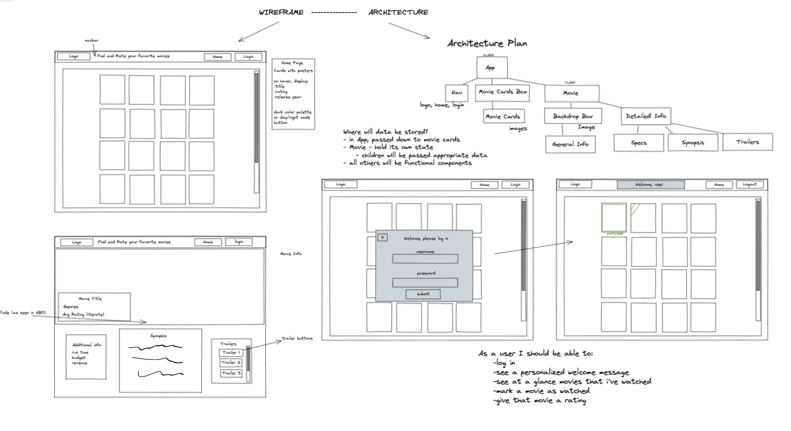

# A+ Films

## Contributors
[Rachel Hill](https://github.com/rachellhill)

[Artan Myrtolli](https://github.com/artanmyrtolli)

## Overview

A+ Films is a web application that offers users a wide variety of award-winning movies to watch on demand.

## Front End Set Up Instructions

1. Clone the repo down to your machine
2. Open the root directory and run `npm i` to install dependencies
3. Run `npm start` in the terminal to open the webpage
4. Open a second terminal tab and run `npm run cypress` (while localhost:3000 is still running) to access the cypress testing for this app

## Back End Set Up Instructions

In addition to the above repo running in your terminal, you will also need to follow the steps below to start the back end api that we created.
1. Clone down [THIS](https://github.com/rachellhill/A-Plus-Films-api) repo
2. `cd` into `A-Plus-Films-api`
3. Run `npm init`
4. Run `npm i express`
5. Run `node server.js` to start the back end server

## Logging in

Please use the username `user` to login

## Features

- Allows a user to browse through a list of movies, click on a single movie to view additional details of your selected movie, and watch trailers.

- A user is able to login and see which movies they have watched as well as what they rated that movie.

- A user is able to 'watch' a move by selecting the button 'Mark as Watched' and submitting a rating of that movie. The movie will then be marked as watched.

## Technologies Used

- React.js
- React Router
- Cypress Testing
- CSS
- HTML
- RESTful APIs
- Express.js

## Goals

- Gain competency with React fundamentals
- Learn how to test React components & asynchronous JS
- Practice refactoring
- Create a multi-page UX using Router
- Full project spec can be found [here](https://frontend.turing.edu/projects/module-3/rancid-tomatillos-v3.html).

## Wins

- Built out a back end server using Express.js to send and receive user information for logging in and rating a movie
- Created additional features for a user to login, see their prior watched movies and ratings, and submit new ratings for other movies they watch.

## Future Additions

- User can create an account with a unique username and password
- Embed trailer videos to watch / play the video in the browser

## Design Inspiration

- [Wireframe & architecture](https://excalidraw.com/#room=54beaa83c5da0f337688,4XdJNsdqnpbtLkpqtBufqg)

- [HBO Max](https://play.hbomax.com/page/urn:hbo:page:home?utm_id=sa%7c71700000067030777%7c58700006926526610%7cp62287911527&gclid=CjwKCAjw4ayUBhA4EiwATWyBrrXzynAxXke-w_0iw9kLwV1nEWtStiAUtldL3-XjiMe4mSQVp6-hwRoC5rcQAvD_BwE&gclsrc=aw.ds) was the main source of the design inspiration, along with [YTX.mx](https://yts.mx/) for page layout and structure
